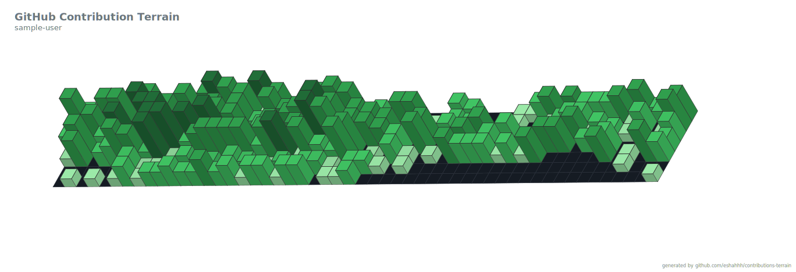
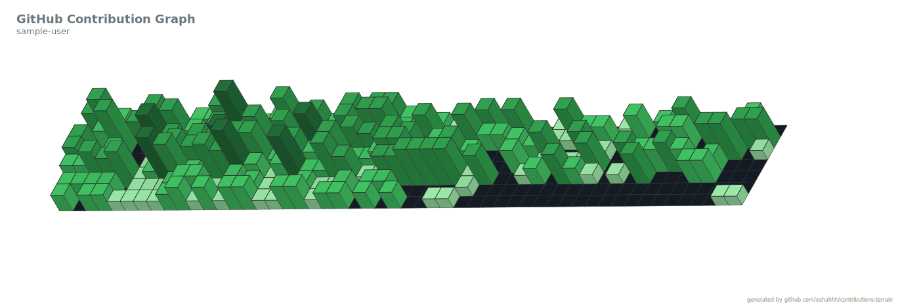

# Contributions-Terrain

Generate a contribution graph or terrain from a github user's contributions

Terrain mode

 
Graph mode (default)


Fetch a github user's contributions. Generate a 3D isometric projection or a a terrain mesh svg. 

Available as github action. It can automatically generate a new image each day. Which makes for great [github profile readme](https://docs.github.com/en/free-pro-team@latest/github/setting-up-and-managing-your-github-profile/managing-your-profile-readme)


## Usage

### **github action**

```yaml
- name: Generate Contribution Terrain
  uses: eshahhh/contribution-terrain@v1
  with:
    username: ${{ github.repository_owner }} # github user name to read the contribution graph from
    style: terrain # or graph
    output_dir: output_directory # optional, defaults to the root
    github_token: ${{ secrets.GITHUB_TOKEN }}
```

